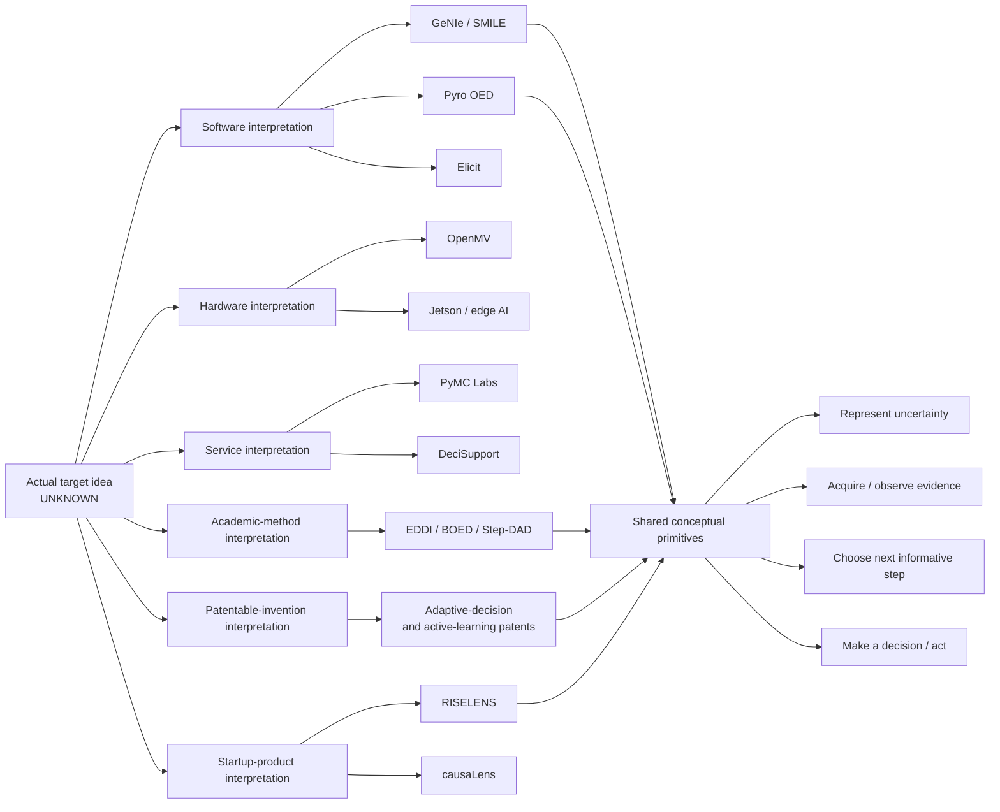
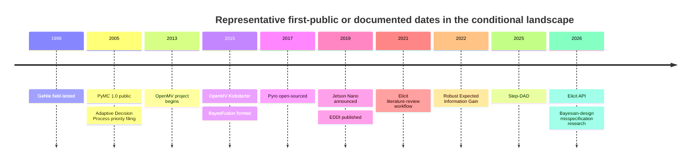

# Prior-Art and Competitive Landscape for an Unspecified Product or Idea

## Executive summary

**Target product / idea: Unknown.**  
**Geography: Unspecified.**  
**Budget: Unspecified.**  
**Timeline: Unspecified.**  
**Intended customer: Unknown.**  
**Technical mechanism: Unknown.**  
**Business model: Unknown.**  
**Patent claims or proposed claim language: Unknown.**

That missing specification is decisive. There is no rigorous way to answer “does something similar already exist?” for the *actual* idea without knowing at least its problem, user, mechanism, inputs/outputs, and differentiating features. Patent analysis is even more feature-specific: the EPO selects “closest prior art” based on similar purpose/effect and the smallest structural or functional modifications needed to reach the claimed invention, while U.S. novelty analysis turns on what was publicly available before the effective filing date. citeturn17search0turn15search3

Accordingly, the defensible answer is:

> **Whether something similar already exists to the actual idea is currently undetermined because the idea is Unknown.**

However, a broad search across six plausible interpretations finds a **substantial and mature prior-art landscape** if the eventual idea concerns uncertainty-aware decision support, adaptive information acquisition, diagnostic test selection, evidence-driven research, or closed-loop “observe → update → choose what to inspect next → act” systems. Existing work includes GeNIe’s value-of-information ranking of diagnostic tests and questions; Pyro’s Bayesian optimal experimental-design module; EDDI’s cost-aware acquisition of additional information; a 2005-priority patent explicitly describing automated, adaptive, closed-loop information gathering based on decision analysis and value of information; and a Bayesian troubleshooting patent that repeatedly re-ranks tests as evidence accumulates. citeturn14search3turn14search0turn14search2turn15search1turn16search0

That matters because, **conditional on the idea belonging to this neighborhood, the broad concept is not new**. In particular, a generic claim such as “maintain uncertainty, evaluate possible information-gathering steps according to expected information/value and cost, acquire the best observation, update beliefs, and repeat” has strong conceptual predecessors dating at least to the mid-2000s and strong academic implementations thereafter. This is an analytical inference from the cited prior art, not a legal patentability opinion. citeturn15search1turn16search0turn16search1turn14search2

The landscape is much less conclusive under a **hardware** interpretation. NVIDIA Jetson, OpenMV, and Arduino provide sensor/edge-computing hardware capable of local inference, but the sources reviewed do not show those products themselves implementing a general-purpose decision-theoretic policy for deciding which observation is worth acquiring next. citeturn19search6turn19search0turn19search3

The likely opportunity, **if** the ultimate concept resembles the evidence/decision pattern above, would therefore not be “Bayesian decision making” or “value of information” alone. More defensible differentiation may lie in a particular integrated architecture—for example, combining unstructured evidence ingestion, provenance and source-dependence modeling, uncertainty propagation, decision-specific value of information, money/latency/human-effort costs, stopping rules, actions and human escalation, and an auditable developer API. This is a gap hypothesis rather than a finding of legal novelty; individual pieces already have substantial prior art. Recent research also shows that naïvely maximizing information can become unreliable under model misspecification, making robustness a potentially important implementation differentiator. citeturn20search1turn20search2

A contextual note is necessary: the uploaded material contains a concrete “MeasureTwice” cross-domain sketch involving evidence, uncertainty, observations, next-check selection and actions. Under your explicit instruction, **I have not treated that document as the target specification**; it is context only, and the target remains **Unknown**. fileciteturn0file0

## Scope, assumptions, and research method

The analysis uses six deliberately different interpretations so that the search does not silently assume that “idea” means software. Similarity in the tables is therefore **conditional on each interpretation**, not a similarity judgment against the unknown real idea.

| Interpretation | Working search anchor |
|---|---|
| **Software application/library** | Software that represents uncertainty/evidence and recommends a useful next observation, test, or action |
| **Hardware device** | A sensor or edge-computing device that collects evidence, performs local inference, and can support adaptive sensing/actions |
| **Service** | A managed research, diagnostic, analytic, or consulting service that gathers evidence to improve consequential decisions |
| **Academic method** | Value of information, Bayesian experimental design, active information acquisition, sequential/adaptive experiment selection |
| **Patentable invention** | Computer-implemented closed loop combining uncertainty inference, candidate tests/observations, their value/cost, updates, and decisions |
| **Startup product** | Commercial evidence/decision-intelligence system that turns data or sources into recommendations, explanations, or decision workflows |

The **High / Medium / Low** ratings below should be read as follows. **High** means that most of the *working interpretation's* core functions are present. **Medium** means substantial workflow or subsystem overlap. **Low** means an enabling technology or adjacent workflow rather than the same system. A High rating is **not** a statement that the unknown actual idea is highly similar.

Research prioritized first-party product documentation, official project repositories, peer-reviewed publisher pages, USPTO/EPO materials, and patent publications. Startup-database discovery passes also included Crunchbase/Wellfound-style sources, but current feature and pricing assertions below are preferentially taken from company sites. For open-source projects, official GitHub repositories were checked; for example, `pyro-ppl/pyro` and `openmv/openmv` are active public repositories, and OpenMV's repository describes its Python-programmable cameras, AI capabilities and licensing structure. citeturn19search0

For patent searching, the two key official resources are [USPTO Patent Public Search](https://www.uspto.gov/patents/search/patent-public-search), which exposes U.S. patents and published applications with basic and advanced querying, and [EPO Espacenet](https://worldwide.espacenet.com/). The EPO reported that Espacenet passed 160 million patent documents in April 2025 and is updated with material from patent offices worldwide. citeturn15search0turn17search3

The EPO expressly recommends searching **both products and patents**, moving from keywords into CPC/IPC classifications, searching historical as well as current material, and periodically re-running a search. It also warns that even an official patent-office examination is not conclusive proof that no prior art exists. citeturn17search17 This report should therefore be treated as a **landscape screen**, not a patent-clearance or freedom-to-operate opinion.

## Conditional landscape by interpretation

**Software application / library interpretation**

This interpretation assumes a general software system whose distinguishing behavior is not simply predicting an outcome but deciding what evidence, diagnostic, question, or measurement is worth obtaining next.

| Name | Type | URL | Key features | Target users | Business model | Launch / publication | Conditional match |
|---|---|---|---|---|---|---|---|
| **GeNIe Modeler / SMILE** | Existing product | [BayesFusion](https://www.bayesfusion.com/genie/) | Bayesian networks, influence diagrams, evidence sets, decisions/utilities; diagnostic functionality calculates value of information and rank-orders possible tests/questions. citeturn14search3turn14search5 | Decision analysts, researchers, commercial/government users | Free academic research/teaching access; commercial ecosystem/licensing and services. citeturn21search0turn21search8 | Developed 1995–2015; field-tested since 1998; BayesFusion formed in 2015. citeturn21search0turn21search13 | **High** — explicit uncertainty + decisions + VOI-based next-test ranking |
| **EDDI** | Academic paper/method | [PMLR](https://proceedings.mlr.press/v97/ma19c.html) | Chooses costly missing information using expected information gain; reports cost/decision-quality tradeoffs. citeturn14search2 | ML researchers; potential healthcare/decision-system builders | Academic research | 2019 citeturn14search2 | **High** — highly similar information-acquisition primitive |
| **US20060184482A1 — Adaptive decision process** | Patent publication | [Google Patents](https://patents.google.com/patent/US20060184482) | Combines decision analysis, value of information, experiment design and inference into automatic adaptive closed-loop information gathering; explicitly permits information-gathering cost and correlated uncertainties. citeturn15search1 | Developers/owners of decision-support systems | Patent/IP asset; not itself a SaaS offering | Priority Feb. 14, 2005; published 2006. citeturn15search1 | **High** — unusually close at the abstract architectural level |
| **Elicit** | Startup / commercial software | [Elicit](https://elicit.com/) | Search and synthesis across a large scholarly corpus, Research Agent/Reports, systematic-review workflow, source visibility, extraction and API access. citeturn18search2turn18search15 | Researchers, evidence teams, enterprises | Free tier + paid per-user plans + enterprise offering. citeturn18search2 | First literature-review workflow launched Aug. 31, 2021; API preview launched Mar. 3, 2026. citeturn18search1turn18search15 | **Medium** — strong evidence workflow; less explicit about probabilistic VOI selection |
| **Pyro + `pyro.contrib.oed`** | Open-source project | [Pyro](https://pyro.ai/) / [GitHub](https://github.com/pyro-ppl/pyro) | Probabilistic programming plus Bayesian optimal experiment design; can choose experimental designs maximizing expected information gain. citeturn14search0turn14search6 | ML researchers and developers | Open source | Pyro open-sourced Nov. 2, 2017. citeturn21search5 | **High** for the computational primitive; **Medium** as a complete end-user product |

**Assessment:** under this interpretation, the answer to “does something similar exist?” is clearly **yes**. The strongest references are not superficial AI applications; GeNIe, Pyro/BOED, EDDI and the 2005-priority adaptive-decision patent directly address the choice of what information to acquire under uncertainty. citeturn14search5turn14search0turn14search2turn15search1

**Hardware-device interpretation**

Here the hypothetical idea is an embedded device that observes the physical world and runs inference or adaptive acquisition locally.

| Name | Type | URL | Key features | Target users | Business model | Launch / publication | Conditional match |
|---|---|---|---|---|---|---|---|
| **NVIDIA Jetson Nano** | Hardware product | [NVIDIA](https://developer.nvidia.com/embedded/jetson-nano) | Edge-AI computer supporting high-resolution and parallel sensors and multiple neural networks; announced at 472 GFLOPS and 5 W minimum. citeturn19search6 | Developers, makers, embedded-product companies | Hardware sales; launch pricing was $99 dev kit/$129 production module. citeturn19search6 | Mar. 18, 2019 citeturn19search6 | **Low** — powerful inference substrate, but not itself a general VOI/next-measurement system |
| **EDDI** | Academic method | [PMLR](https://proceedings.mlr.press/v97/ma19c.html) | Formal mechanism for deciding which additional measurements are worth acquiring at a cost. citeturn14search2 | Adaptive sensing/ML researchers, among others | Academic research | 2019 citeturn14search2 | **Medium** conceptually — could drive adaptive sensing, but contains no particular hardware |
| **US8463641B2 — Bayesian diagnostic test-cost system** | Patent | [Google Patents](https://patents.google.com/patent/US8463641B2) | Iteratively ranks component faults and pending diagnostic tests using accumulated evidence, information reduction and test costs; described for complex equipment including aerospace. citeturn16search0 | Maintenance/diagnostic-system builders | Patent/IP | Prior-art date Oct. 5, 2007; patent published/granted in 2013. citeturn16search0 | **Medium** — very close if hardware idea includes built-in troubleshooting/test selection |
| **OpenMV Cam / OpenMV LLC** | Hardware/startup product | [OpenMV](https://openmv.io/) | Small Python-programmable machine-vision devices; current project supports image processing, AI acceleration, sensors and hardware control/RPC. citeturn19search0turn19search1 | Robotics, embedded vision, industrial developers | Hardware sales; most repository code open-source, with some separately licensed/proprietary components. citeturn19search0 | Project created 2013; Kickstarter funded in 2015. citeturn19search1turn19search0 | **Medium** as programmable sensing hardware; **Low** on decision-theoretic acquisition |
| **OpenMV firmware** | Open-source project | [GitHub](https://github.com/openmv/openmv) | Python-programmable embedded vision, detection/tracking, AI models, RPC and physical I/O/control. citeturn19search0 | Embedded developers | Mostly open source, subject to documented component-specific exceptions. citeturn19search0 | Project lineage 2013; Kickstarter 2015. citeturn19search1turn19search0 | **Medium** enabling substrate; no general “best next observation” abstraction documented |

Arduino's Portenta Vision Shield is another adjacent product: it launched on October 6, 2020 with a low-power camera, dual microphones and connectivity for edge-ML applications. It reinforces the conclusion that **physical evidence acquisition and edge inference are commoditized building blocks**, while the more interesting potential differentiation would lie in an adaptive policy that decides *what to sense and when*. citeturn19search3

**Service interpretation**

Here the hypothetical offering is not primarily packaged software or hardware but a managed service that evaluates uncertainty, acquires evidence and helps a client make a decision.

| Name | Type | URL | Key features | Target users | Business model | Launch / publication | Conditional match |
|---|---|---|---|---|---|---|---|
| **GeNIe / BayesFusion services** | Product + professional services | [BayesFusion](https://www.bayesfusion.com/) | Bayesian-network software accompanied by training, scientific consulting and custom-software development. citeturn21search8 | Organizations implementing probabilistic decision systems | Software licensing + consulting/training | BayesFusion formed 2015; GeNIe predates it. citeturn21search0 | **Medium** — close methodology delivered with professional assistance |
| **EDDI** | Academic method | [PMLR](https://proceedings.mlr.press/v97/ma19c.html) | Formalizes the tradeoff between acquiring further information and the cost of that acquisition. citeturn14search2 | Analysts/researchers building evidence-acquisition services | Academic | 2019 citeturn14search2 | **Medium** — strong service-design principle but not a service |
| **Adaptive decision process** | Patent | [Google Patents](https://patents.google.com/patent/US20060184482) | Generic automated/semi-automated decision and information-gathering loop across domains, including costs and dependencies. citeturn15search1 | Decision-service implementers | Patent/IP | Priority 2005; publication 2006. citeturn15search1 | **High** conceptually if the service productizes such a loop |
| **PyMC Labs** | Commercial consultancy | [PyMC Labs](https://www.pymc-labs.com/) | Bayesian AI consulting for high-stakes decisions, including strategy consulting, custom model delivery, embedded teams and training. citeturn21search1turn21search17 | Enterprises facing uncertainty in forecasting, supply chain, risk and related areas | Paid consulting, solution delivery, expert access and training | Exact company launch date was not established in the official pages reviewed; PyMC itself began in 2003 and reached public v1.0 in 2005. citeturn21search2turn21search3 | **Medium** — commercial uncertainty-aware decision expertise, but not necessarily automated next-check selection |
| **OpenMarkov** | Open-source project / service ecosystem | [OpenMarkov](https://www.openmarkov.org/) | Open-source Bayesian networks, influence diagrams and cost-effectiveness analysis; its creators' DeciSupport spin-off offers consulting, courses and custom software. citeturn14search1 | Decision analysts, especially healthcare/probabilistic-AI users | Open source plus separate professional services | Public tutorial version 0.1.6 dated Jun. 3, 2015; initial launch not established here. citeturn14search4 | **Medium** |

The important competitive observation is that “expert help making decisions under uncertainty” is already a service category. A new service would need a sharper wedge—such as dramatically lower evidence-acquisition cost, a reusable automated decision loop, verifiable provenance, a vertical specialization, or superior measurable outcomes—rather than merely branding Bayesian reasoning as a service. citeturn21search17turn14search1

**Academic-method interpretation**

This is where the strongest historical overlap appears. The relevant academic traditions include decision analysis/value of information, Bayesian optimal experimental design, active learning and sequential/adaptive experiment design.

| Name | Type | URL | Key features | Target users | Business model | Launch / publication | Conditional match |
|---|---|---|---|---|---|---|---|
| **GeNIe VOI** | Product implementation | [GeNIe VOI docs](https://support.bayesfusion.com/docs/GeNIe/id_voi.html) | Computes expected value of observing uncertain variables before a decision; GeNIe also exposes decision/utility models. citeturn14search5turn14search3 | Decision analysts/researchers | Academic-free/commercial ecosystem | Field-tested since 1998. citeturn21search13 | **High** implementation overlap |
| **Step-DAD** | Academic paper | [PMLR](https://proceedings.mlr.press/v267/hedman25a.html) | Adaptive policy-based Bayesian experimental design; updates its design policy as evidence is gathered and reports improved flexibility/robustness over compared methods. citeturn20search3 | ML/experimental-design researchers | Academic | 2025 citeturn20search3 | **High** — explicit sequential selection of new experiments |
| **US20100332423A1 — Generalized active learning** | Patent | [Google Patents](https://patents.google.com/patent/US20100332423) | Selects unobserved labels/features using an ROI metric combining uncertainty/value and observation cost, observes the variable, and updates probability distributions. citeturn16search1 | Active-learning and diagnostic-system builders | Patent/IP | Prior-art date Jun. 24, 2009; published 2010. citeturn16search1 | **High** |
| **causaLens decisionOS** | Commercial/startup platform | [decisionOS](https://causalai.causalens.com/decision-os/) | Causal modeling, recommendations, interactive decision apps and operational decision workflows; commercial licensing is quote-based. citeturn18search6 | Enterprise data-science and business teams | Enterprise platform licensing | decisionOS publicly documented by 2022–2023 sources reviewed; exact first launch was not established. citeturn18search7turn18search13 | **Medium** — strong decision workflow, weaker match to adaptive information acquisition |
| **Pyro OED** | Open-source implementation | [Pyro OED docs](https://docs.pyro.ai/en/dev/contrib.oed.html) | Selects experiment designs maximizing expected information gain; can be used adaptively as posterior knowledge evolves. citeturn14search0turn14search6 | Probabilistic-ML researchers/developers | Open source | Pyro open-source release 2017. citeturn21search5 | **High** computational-method overlap |

The academic space is still moving. Foster et al. proposed a scalable stochastic-gradient treatment of Bayesian-optimal experiment design in 2020; robust EIG work in 2022 addressed sensitivity to uncertain priors; Step-DAD in 2025 added test-time policy adaptation; and 2026 work is investigating model misspecification, cheaper policy training and alternative design objectives. citeturn20search0turn20search1turn20search3turn20search2turn20search6

That makes it risky to characterize an eventual idea simply as a new “method for deciding which experiment/question/check to perform next.” The field already has several mature mathematical formulations for that problem. citeturn14search0turn14search2turn20search0

**Patentable-invention interpretation**

This interpretation is the most conservative: assume someone might try to patent a computer-implemented workflow that represents uncertainty, gathers observations selectively and uses the results to make decisions.

| Name | Type | URL | Key features | Target users | Business model | Launch / publication | Conditional match |
|---|---|---|---|---|---|---|---|
| **GeNIe** | Existing product / potential non-patent prior art | [BayesFusion](https://www.bayesfusion.com/genie/) | Influence diagrams, decision/utility models and VOI-ranked diagnostic tests/questions. citeturn14search3turn14search5 | Decision-system builders | Software ecosystem | Field-tested since 1998. citeturn21search13 | **High** against generic claims around VOI-guided diagnosis |
| **Foster et al., Bayesian-optimal experiments** | Academic publication / non-patent literature | [PMLR](https://proceedings.mlr.press/v108/foster20a.html) | Optimizes experimental designs using expected-information-gain objectives and stochastic gradients. citeturn20search0 | Researchers/system implementers | Academic | 2020 citeturn20search0 | **High** against generic experiment-selection claims |
| **US20060184482A1** | Patent publication | [Google Patents](https://patents.google.com/patent/US20060184482) | Decision analysis + VOI + experiment design + inference + adaptive closed-loop information gathering; includes cost and dependency concepts. citeturn15search1 | Decision-system inventors/operators | IP | Priority 2005; published 2006. citeturn15search1 | **High** — key reference |
| **RISELENS** | Commercial product/startup | [RISELENS](https://riselens.com/) | Structures evidence into weighted evaluations, exposes uncertainty, produces recommendations and traces conclusions to evidence; supports scenarios and audit/version history. citeturn18search0 | Analysts, decision teams, regulated/high-stakes organizations | Per-user subscription plus enterprise tier; official page currently lists €39/user/month Starter and €159/user/month Team when billed annually. citeturn18search0 | Exact launch not stated; company site is current in 2026. citeturn18search0 | **Medium** — strong evidence/decision/audit overlap; no explicit VOI next-check behavior documented |
| **Pyro OED** | Open-source/non-patent prior art | [GitHub](https://github.com/pyro-ppl/pyro) | Public implementation of probabilistic inference and EIG-based experimental-design machinery. citeturn14search0turn21search5 | Developers/researchers | Open source | 2017 Pyro release; OED later part of the documented project | **High** at algorithm/tooling layer |

In U.S. analysis, relevant prior art is not restricted to competing patents: AIA §102 can encompass patents, printed publications, public uses, sales and other public availability, depending on timing and applicable exceptions. citeturn15search3 The EPO likewise emphasizes that an existing product is only one kind of prior art and explicitly directs inventors toward patents, publications, academic work and historical products as well. citeturn17search17

Therefore, **a commercially unique packaging does not by itself imply patent novelty**. The eventual technical claims would have to be charted feature-by-feature against references such as US20060184482A1, US20100332423A1, US8463641B2, GeNIe, EDDI and the Bayesian experimental-design literature. citeturn15search1turn16search1turn16search0turn14search5turn14search2

**Startup-product interpretation**

This interpretation assumes a venture-backed or startup-style commercial product around evidence, uncertainty and decisions.

| Name | Type | URL | Key features | Target users | Business model | Launch / publication | Conditional match |
|---|---|---|---|---|---|---|---|
| **RISELENS** | Commercial product | [RISELENS](https://riselens.com/) | Evidence graph, weighted criteria, explicit uncertainty, recommendations, source traceability, scenarios, audit trail. citeturn18search0 | Analysts, consultants, operational/regulated decision teams | Subscription + enterprise | Launch date not stated; active official site in 2026. citeturn18search0 | **High** for evidence-to-decision product; **Medium** if next-information selection is essential |
| **EDDI** | Academic precursor | [PMLR](https://proceedings.mlr.press/v97/ma19c.html) | Decision-relevant acquisition of missing information at a cost. citeturn14search2 | Product teams building adaptive evidence acquisition | Academic | 2019 citeturn14search2 | **High** at algorithmic layer |
| **US20100332423A1** | Patent precursor | [Google Patents](https://patents.google.com/patent/US20100332423) | Chooses missing information using value/uncertainty/cost ROI, then updates distributions. citeturn16search1 | Diagnostic/active-learning product builders | IP | 2009 priority; 2010 publication. citeturn16search1 | **High** at generic mechanism layer |
| **Elicit** | Startup/product | [Elicit](https://elicit.com/) | Research/evidence search, reports, extraction, systematic reviews, source visibility and API. citeturn18search2turn18search15 | Researchers and enterprise evidence teams | Freemium subscriptions + enterprise | Literature-review workflow since Aug. 31, 2021. citeturn18search1 | **Medium** — especially close if target is research/verification rather than arbitrary operational decisions |
| **OpenMarkov** | Open-source alternative | [OpenMarkov](https://www.openmarkov.org/) | Bayesian/influence-diagram models, decision analysis and cost-effectiveness analysis; service ecosystem via DeciSupport. citeturn14search1turn14search7 | Analysts, researchers, healthcare decision-model developers | OSS; related paid consulting/custom work | Public tutorial documented by 2015. citeturn14search4 | **Medium** — strong analytical substitute, weaker modern SaaS workflow |

There are also broader commercial substitutes. causaLens positions decisionOS as an enterprise decision-making platform that converts causal-model outputs into quantitative recommendations and deployed decision applications, while PyMC Labs is now marketing an end-to-end “Decision AI” ecosystem from model building through decision interfaces and downstream actions. citeturn18search6turn21search12 This increases the burden on a new startup to establish a narrow, measurable wedge rather than relying on “AI for decision intelligence” as a differentiated category description.

## Cross-domain synthesis and visualizations

Across all six interpretations, the same underlying concepts recur in different forms:

**probabilistic state / uncertainty → new observation → belief update → compare possible next tests or experiments → decision/action**.

GeNIe expresses this through influence diagrams and value of information; EDDI through expected-information-gain acquisition of costly variables; Pyro through Bayesian optimal experimental design; US20060184482A1 through an adaptive closed-loop information-gathering architecture; US8463641B2 through iterative cost-aware troubleshooting; and modern commercial systems such as RISELENS/Elicit through evidence-oriented decision or research workflows. citeturn14search5turn14search2turn14search0turn15search1turn16search0turn18search0turn18search2

The historical sequence is also important. The concept is not emerging for the first time in the current generative-AI cycle. GeNIe was developed from 1995 and field-tested from 1998; the adaptive-decision patent claims 2005 priority; PyMC became public in 2005; OpenMV began in 2013; Pyro was open-sourced in 2017; Jetson Nano and EDDI appeared in 2019; Elicit's literature-review workflow launched in 2021; robust EIG work appeared in 2022; Step-DAD in 2025; and 2026 research is explicitly confronting misspecification and computational issues in experimental design. citeturn21search0turn15search1turn21search2turn19search1turn21search5turn19search6turn14search2turn18search1turn20search1turn20search3turn20search2turn20search6

The strongest overall conclusion is therefore **fragmentation rather than absence**. In the reviewed sources, different products solve different pieces: probabilistic decision modeling, optimal experiment choice, research/evidence retrieval, provenance, edge sensing, causal recommendations, or consulting. I did **not** find, in this conditional sample, one clearly documented product that simultaneously provides all of the following as a general-purpose system:

> unstructured-source ingestion + explicit source provenance/dependence + probabilistic beliefs + downstream decision utilities + money/time/human-effort costs for checks + next-observation VOI + stopping + human escalation + action execution + an auditable cross-domain API.

That is an **inference from the surveyed sample, not proof that no such system exists**. The EPO's own guidance is a useful warning here: absence of a result is never conclusive proof of novelty, and searches need to be iterated with classifications and newly discovered terminology. citeturn17search17

## Patent and novelty implications

The preliminary prior-art risk is highly asymmetric.

If the eventual invention is simply an **AI application**, **edge sensing device**, or **research service**, the current search is too abstract to say much about novelty. Once its actual technical architecture is known, completely different CPC/IPC classes and prior-art families may become relevant.

If, however, the idea is a generic **adaptive decision-support engine that chooses what information to obtain next**, several references deserve immediate claim-chart treatment.

**US20060184482A1 is the most concerning broad reference found in this pass.** Its disclosure expressly combines decision analysis, value-of-information analysis, design of experiments and inferencing, and describes an automatic adaptive closed loop for obtaining and assimilating additional information. It further contemplates the cost of gathering information and dependencies/correlations among uncertain variables. Its priority claim dates to February 14, 2005. citeturn15search1

**US20100332423A1 adds a closely related active-information-acquisition disclosure.** It models observed and unobserved variables, selects an unobserved variable according to an ROI metric involving uncertainty/value and observation cost, observes that variable, then updates probability distributions. citeturn16search1

**US8463641B2 is particularly relevant to diagnostic/troubleshooting embodiments.** It uses a Bayesian network, accumulating test evidence, information-entropy reduction and test cost to repeatedly rank which troubleshooting test should be performed next. citeturn16search0

And these patents do not stand alone. GeNIe has long exposed decision models and VOI calculation; EDDI formalizes cost-aware dynamic acquisition; Pyro exposes EIG-based experiment-design machinery; and current academic work continues to generalize sequential Bayesian experimental design. citeturn14search5turn14search2turn14search0turn20search3

Consequently, **my preliminary inference is that broad claims to the loop itself would face significant prior-art pressure**:

> model uncertainty → score possible observations/tests → account for information value and/or cost → choose one → observe → update → repeat → act.

The safer patentability question is not “has anyone done that loop?” but:

> **What exact technical mechanism, data structure, inference method, dependence representation, acquisition objective, interface architecture, safety constraint, distributed implementation, or domain-specific hardware interaction is different from the closest prior art, and what technical effect does that difference produce?**

That framing closely follows the EPO's problem-solution approach: identify the closest prior art, identify structural/functional differences and their technical effect, formulate the objective technical problem, and then ask whether the solution would have been obvious. citeturn17search0turn17search10turn17search11 The EPO also notes that multiple prior-art teachings may be combined when analyzing inventive step, so merely assembling known components is not automatically enough. citeturn17search5

Patent searching should therefore proceed from keywords into **CPC/IPC classifications, backward and forward citations, family members and non-patent literature** once the actual idea is specified. The EPO specifically recommends shifting from keywords to classifications found in the most relevant patent documents. citeturn17search17 USPTO Patent Public Search supports advanced fielded searches for the corresponding U.S. pass. citeturn15search0

No legal-status conclusions have been relied on here. Google Patents itself warns that displayed legal status is not a legal conclusion, so live status, prosecution history, claims and family relationships should be checked through official patent-office records before making an infringement/FTO judgment. citeturn16search0turn16search1

## Gaps and differentiators

The following are **candidate differentiation directions**, not declarations of novelty. Each would still need a dedicated product and patent search after the actual design is specified.

| Candidate differentiator | Why it could matter | Existing overlap / novelty risk |
|---|---|---|
| **Evidence lineage and dependence-aware confidence** | Prevent multiple derivative sources or evaluators from being treated as independent evidence; make confidence reflect common provenance | The 2005 adaptive-decision patent already discusses dependencies/correlations among uncertain variables, so “handle dependence” broadly is not new. A specific scalable provenance/dependence architecture could still differ. citeturn15search1 |
| **Decision-aware stopping** | Stop researching/testing once another observation is unlikely to change the optimal action enough to justify its cost | VOI theory, GeNIe and EDDI already establish the underlying economics of information, so differentiation would need to be in implementation, integration, approximation or operational policy. citeturn14search5turn14search2 |
| **Unified unstructured `read → observe → choose → act` developer API** | Could bridge LLM extraction, structured uncertainty, decision utilities, checks and actions without requiring separate research/modeling/orchestration tools | No reviewed product obviously provides this complete abstraction, but virtually every individual primitive exists. This makes it an integration/product-design opportunity more than obvious foundational-algorithm novelty. citeturn18search15turn14search0turn14search3 |
| **Robust acquisition under model misspecification** | Prevent a system from becoming confidently wrong because its assumed generative model is wrong | Already an active research field: robust EIG appeared by 2022, and 2026 work shows classical “more information is better” rankings can become harmful under misspecification. Implementation/productization could differentiate; the basic concern is not novel. citeturn20search1turn20search2 |
| **Generalized check cost** | Treat API spend, latency, customer friction, human-review time, irreversible actions and opportunity cost in one selection policy | Historical patents already include test/information costs. A richer operational cost model may be useful commercially but needs a much narrower novelty theory. citeturn15search1turn16search0 |
| **Auditable “why this check next?” explanations** | Makes automated investigation usable in regulated or high-stakes settings and enables review of rejected alternatives | RISELENS already emphasizes traceability, assumptions, confidence and audit history; explainability alone is therefore a weak differentiator. citeturn18search0 |
| **Cross-domain adapters with one decision grammar** | Same core engine could operate on support tickets, incidents, supplier evidence, documents, tests or physical sensors | Existing tools are usually concentrated in modeling, research, enterprise causal analysis, or physical sensing. A convincing cross-domain abstraction could be a product wedge, but generic “domain-independent” treatment appears in older adaptive-decision prior art. citeturn15search1turn14search3turn19search0 |
| **Human escalation as an economically modeled observation** | Treat expert review as a check with cost, latency and reliability rather than a hard-coded fallback | This appears commercially interesting in the surveyed product set, but a dedicated patent search would be needed before claiming novelty; general cost-aware test selection is already old. citeturn16search0turn14search2 |
| **Decision-specific rather than information-only acquisition** | A check is valuable because it changes the action, not merely because it reduces entropy | Classical influence-diagram VOI already explicitly values information relative to expected utility, so this principle is established prior art. citeturn14search5 |
| **Reliable operation when observations come from LLMs** | Explicitly model extractor reliability, hallucination risk, source support and dependency between model outputs and original evidence | This particular modern integration could merit targeted searching, but Elicit already combines AI research workflows with source-backed output and an API, so “LLM + citations” alone is not differentiated. citeturn18search2turn18search15 |

Two strategic lessons follow.

First, **avoid positioning around primitives that are already named disciplines**: Bayesian networks, value of information, expected information gain, active learning, Bayesian optimal experimental design, decision intelligence, causal AI, evidence traceability or probabilistic programming all have established products, research literatures, or both. citeturn14search1turn14search0turn20search0turn18search6

Second, the most promising differentiation is likely at the **intersection** of those primitives and a narrowly specified operational problem. For example, “generalized VOI” is weak; “a developer runtime that tracks provenance of LLM-derived evidence, models source dependence, values a database query versus a human review against a downstream release decision, and terminates automatically when the decision is stable” is specific enough to search and test meaningfully. That is an analytical recommendation rather than a claim that such an implementation is novel.

## Recommended next steps

The current research has reached the natural limit imposed by the unknown idea. The highest-value next move is not a larger generic search; it is converting the target into something against which products, papers and claims can actually be compared.

| Stage | Recommended action | Concrete deliverable | Decision criterion |
|---|---|---|---|
| **Specify the target** | Write one sentence each for problem, user, input, output, mechanism and why existing approaches fail; identify 5–10 indispensable features | One-page product/technical specification | No further “similarity” conclusion should be treated as meaningful until this exists |
| **Build a feature vector** | Separate essential features from optional implementation details and write synonyms for each | Feature × competitor matrix | Identify the 2–3 features that would have to be absent from prior art for the concept to remain interesting |
| **Product search** | Search exact workflows, substitutes and vertical-specific competitors rather than only the proposed category name; inspect docs, APIs, pricing and archived product history | 20–40 candidate competitors with evidence links | Determine whether a user can already accomplish the same job with acceptable friction |
| **Academic search** | Search VOI, BOED, active feature acquisition, sequential decision analysis, adaptive diagnosis, optimal stopping, costly feature acquisition and domain-specific synonyms | Literature map with seminal + newest methods | Determine which claimed “new algorithm” pieces are established research |
| **Formal patent search** | Run USPTO and Espacenet keyword queries, then pivot into CPC/IPC classes from the closest results; inspect families and forward/backward citations | Patent-family list and element-by-element claim chart | Flag any single reference containing all essential elements and combinations relevant to obviousness/inventive step. citeturn15search0turn17search17 |
| **Professional patent review** | Give the feature/claim chart to qualified patent counsel or a professional prior-art searcher before relying on patentability or FTO conclusions | Patentability/FTO opinion appropriate to intended jurisdictions | Proceed only after distinguishing proposed claims from the strongest references; the EPO itself notes that professional searching may be appropriate and that no search is conclusive. citeturn17search17 |
| **Customer validation** | Interview the intended decision-maker about existing workaround, frequency, consequence of wrong decisions, information costs and willingness to change workflow | Evidence-backed problem statement and ranked jobs-to-be-done | A strong problem should survive discussion without needing the proposed technology explained first |
| **MVP** | Implement only the smallest loop needed to demonstrate the claimed differentiator: evidence → uncertainty → candidate checks → recommendation → update → stop/action | End-to-end prototype in one or two workflows | Measure improvement against the actual baseline, not an imagined competitor |
| **Evaluation** | Track decision accuracy/utility, investigation cost, number of checks, time-to-decision, calibration, false confidence under correlated evidence, and escalation quality | Quantitative benchmark suite | New approach should produce measurable advantage on at least one economically meaningful axis |
| **Market wedge** | Prefer workflows with repeated decisions, observable investigation costs and expensive mistakes—for example technical troubleshooting, incident operations, evidence-intensive qualification/research or quality/verification workflows | Initial ICP + willingness-to-pay test | Look for strong pain and repeatability rather than maximum theoretical market size |
| **IP/design strategy** | Before public disclosure, identify the narrowest technical mechanisms that might support defensible claims; separately document trade secrets, data/network effects and integration moats | IP strategy linked to actual architecture | Do not depend on a patent around the broad adaptive-information loop, given the prior art identified above. citeturn15search1turn16search1turn16search0 |

The most efficient patent-search starting set, **if the eventually specified idea does turn out to involve adaptive evidence acquisition or decision-aware checking**, is:

**US20060184482A1** for automated adaptive closed-loop decision/information gathering; **US20100332423A1** for cost/value-driven acquisition of unobserved variables; **US8463641B2** for iterative cost-aware Bayesian diagnostic tests; GeNIe's long-standing VOI implementation; EDDI and Bayesian optimal experimental-design research; and Pyro's public OED implementation. citeturn15search1turn16search1turn16search0turn14search5turn14search2turn14search0

**Bottom line:** for the literal request, the answer remains **Unknown / undetermined**, because no actual product or claim set was specified. Under the most plausible decision-support interpretation, however, **yes—substantially similar concepts unquestionably already exist**, including surprisingly close patent disclosures dating to 2005, mature value-of-information software, academic cost-aware information-acquisition methods and modern commercial evidence/decision platforms. citeturn15search1turn14search5turn14search2turn18search0 The opportunity, if there is one, is therefore much more likely to reside in a **specific implementation, integration, technical effect, vertical workflow or empirically superior product experience** than in the broad concept of using uncertainty and information value to choose what to check next.
